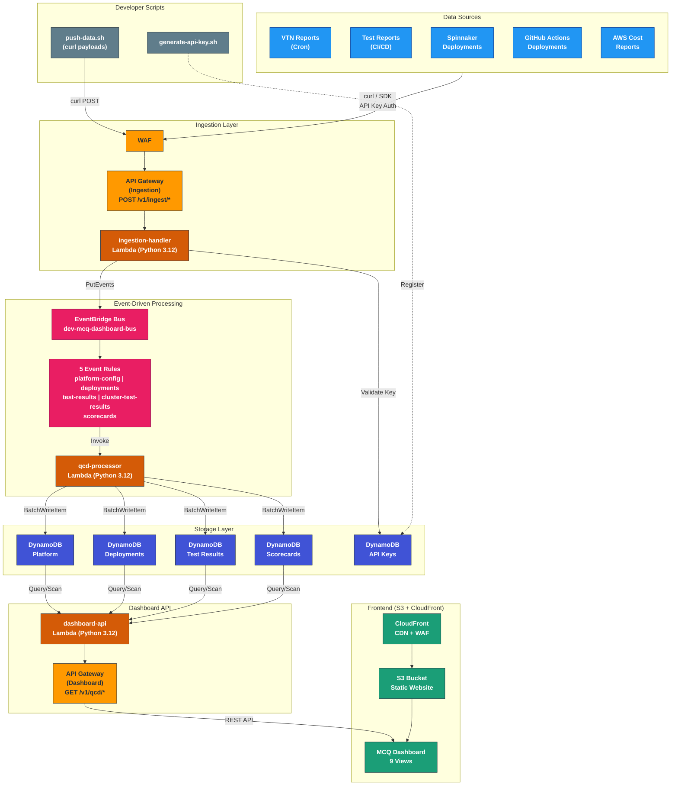
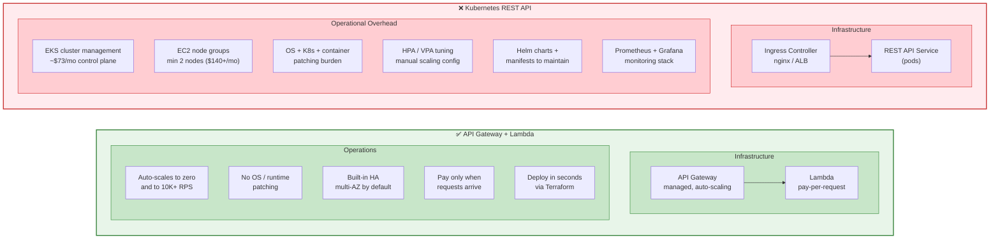
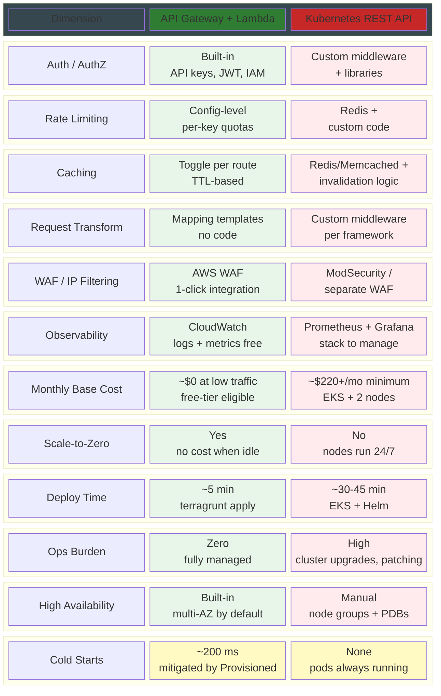
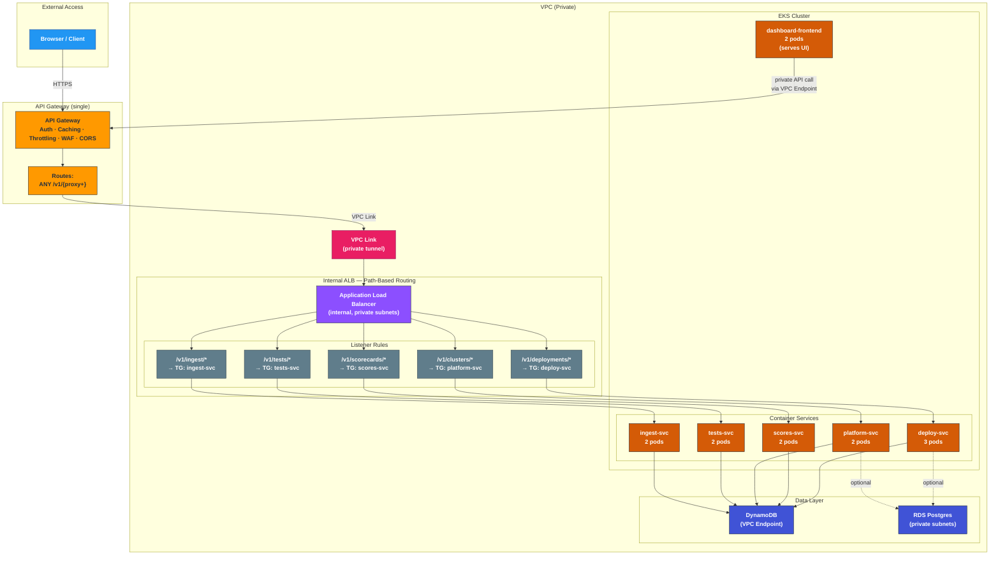

# MCQ Dashboard — Architecture

## System Architecture



## Key Design Decisions

| Aspect | Choice | Rationale |
|--------|--------|-----------|
| Compute | AWS Lambda | Zero servers, pay-per-invocation, auto-scaling |
| Storage | DynamoDB (on-demand) | Sub-ms reads, schemaless JSON, zero admin |
| Event routing | EventBridge | Decoupled, rule-based routing, extensible |
| Frontend hosting | S3 + CloudFront | Global CDN, zero-origin servers |
| Security | WAF + API Key auth | Rate limiting, IP filtering, key validation |
| IaC | Terraform + Terragrunt | Modular, DRY, multi-env ready |

## Data Flow Summary

1. **Ingest** — Data sources POST JSON to `/v1/ingest/{type}` with API key
2. **Validate** — `ingestion-handler` checks the API key against DynamoDB
3. **Route** — Valid events are published to EventBridge with a detail-type
4. **Process** — `qcd-processor` receives matched events and writes to DynamoDB
5. **Serve** — `dashboard-api` reads from DynamoDB and returns JSON via REST
6. **Display** — SPA frontend fetches from the Dashboard API and renders views

---

## API Management + Lambda vs Standalone Kubernetes API

An **API management layer** (AWS API Gateway, Apigee, Kong, etc.) provides
cross-cutting concerns — auth, caching, throttling, transformation — as
configuration rather than code. A standalone REST API on Kubernetes must
implement or bolt on every one of these capabilities manually.

### What an API Gateway Gives You Out of the Box

```mermaid
flowchart TB
    subgraph APIMGMT["✅ API Management Layer (API Gateway / Apigee / Kong)"]
        direction TB

        subgraph BuiltIn["Built-in Capabilities — zero application code"]
            direction LR
            AUTH["🔐 Auth / AuthZ<br/>API keys, OAuth2, JWT<br/>IAM, Cognito, OIDC"]
            THROTTLE["⚡ Rate Limiting<br/>per-key quotas<br/>burst throttling"]
            CACHE["📦 Response Caching<br/>TTL-based, per-route<br/>reduces backend calls"]
        end

        subgraph BuiltIn2[""]
            direction LR
            TRANSFORM["🔄 Request / Response<br/>Transformation<br/>header injection, mapping"]
            WAF_FEAT["🛡️ WAF + IP Filtering<br/>SQL injection, XSS<br/>geo-blocking"]
            OBSERVE["📊 Observability<br/>access logs, metrics<br/>request tracing"]
        end

        subgraph BuiltIn3[""]
            direction LR
            VERSIONING["🏷️ API Versioning<br/>stage management<br/>canary deployments"]
            CORS_FEAT["🌐 CORS<br/>preflight handling<br/>origin whitelisting"]
            DOCS["📄 API Documentation<br/>OpenAPI / Swagger<br/>developer portal"]
        end
    end

    subgraph STANDALONE["❌ Standalone REST API on Kubernetes"]
        direction TB

        subgraph DIY["You Must Build / Integrate Each One"]
            direction LR
            DIY_AUTH["Auth middleware<br/>passport.js / Spring Security<br/>+ token validation code"]
            DIY_THROTTLE["Rate limiter<br/>express-rate-limit / Redis<br/>+ config per route"]
            DIY_CACHE["Cache layer<br/>Redis / Memcached<br/>+ cache invalidation logic"]
        end

        subgraph DIY2[""]
            direction LR
            DIY_TRANSFORM["Custom middleware<br/>for header / body<br/>transformation"]
            DIY_WAF["Separate WAF<br/>or nginx ModSecurity<br/>+ rule maintenance"]
            DIY_OBSERVE["Prometheus + Grafana<br/>+ custom metrics<br/>+ log aggregation"]
        end

        subgraph DIY3[""]
            direction LR
            DIY_VERSION["Ingress path routing<br/>+ Helm chart per version<br/>+ manual canary"]
            DIY_CORS["CORS middleware<br/>per framework<br/>+ testing burden"]
            DIY_DOCS["Swagger codegen<br/>+ manual sync<br/>with implementation"]
        end
    end

    style APIMGMT fill:#E8F5E9,stroke:#2E7D32,stroke-width:2px
    style STANDALONE fill:#FFEBEE,stroke:#C62828,stroke-width:2px
    style BuiltIn fill:#C8E6C9,stroke:#388E3C
    style BuiltIn2 fill:#C8E6C9,stroke:#388E3C
    style BuiltIn3 fill:#C8E6C9,stroke:#388E3C
    style DIY fill:#FFCDD2,stroke:#D32F2F
    style DIY2 fill:#FFCDD2,stroke:#D32F2F
    style DIY3 fill:#FFCDD2,stroke:#D32F2F
```

### API Gateway + Lambda vs Kubernetes REST API



### Side-by-Side Comparison



### When Kubernetes *Would* Make Sense

| Scenario | Why K8s fits |
|----------|-------------|
| Sustained high throughput (>1 M req/day) | Lambda costs may exceed always-on compute |
| Long-running connections (WebSockets, gRPC streams) | Lambda 15-min timeout is a hard limit |
| GPU / ML inference workloads | Lambda has no GPU support |
| Complex service mesh (50+ microservices) | K8s service discovery + Istio shines |
| Strict latency SLA (<10 ms p99) | Cold starts are unacceptable |

### Why Serverless Wins for This Dashboard

1. **Low, bursty traffic** — data pushed a few times per day, dashboard queried intermittently
2. **Zero ops team** — no dedicated SRE to manage cluster upgrades and node patching
3. **Cost efficiency** — free-tier eligible at current scale vs $220+/mo minimum for EKS
4. **Fast iteration** — deploy in 5 min, not 45; tear down and recreate in minutes
5. **Built-in resilience** — API Gateway and Lambda are multi-AZ by default
6. **Cross-cutting concerns for free** — auth, caching, throttling, WAF, and observability are config, not code

---

## Alternative: API Gateway → ALB → EKS Containers

When services already run on Kubernetes, a single API Gateway can front an
internal ALB that path-routes to different container-backed services. This
combines API management (auth, caching, WAF) with container-based workloads.



### How the Pieces Connect

| Component | Role |
|-----------|------|
| **API Gateway** | Single entry point — handles auth, caching, throttling, WAF, CORS, logging |
| **VPC Link** | Private tunnel from API GW into VPC — no public exposure |
| **ALB (internal)** | Path-based routing to target groups — lives in private subnets |
| **Target Groups** | Each maps to a K8s Service (IP mode via AWS LB Controller) |
| **EKS Services** | Each service runs N pods — independently scalable with HPA |
| **Dashboard Pod** | Calls the API privately via VPC Endpoint — never leaves VPC |

### When to Use This Pattern

- You **already have EKS** and want API management without rewriting as Lambdas
- Services need **long-running processes**, persistent connections, or complex runtimes
- You need **independent scaling** per service (HPA per deployment)
- Teams own separate services and deploy **independently via Helm**

### Request Flow

```
┌─────────────────────────────────────────┐
│          API Gateway (one)               │
│  Auth, Caching, Throttling, WAF          │
│                                          │
│  /v1/deployments/*  ──┐                  │
│  /v1/scorecards/*   ──┤                  │
│  /v1/clusters/*     ──┤── ALL routes     │
│  /v1/tests/*        ──┤   forward to     │
│  /v1/ingest/*       ──┘   VPC Link       │
└──────────┬───────────────────────────────┘
           │
      VPC Link
           │
┌──────────▼───────────────────────────────┐
│              VPC                          │
│                                          │
│  ┌─────────────────────────────────┐     │
│  │     ALB (internal, private)      │     │
│  │                                  │     │
│  │  Path Rules:                     │     │
│  │  /v1/deployments/* → TG-deploy   │     │
│  │  /v1/scorecards/*  → TG-scores   │     │
│  │  /v1/clusters/*    → TG-platform │     │
│  │  /v1/tests/*       → TG-tests    │     │
│  │  /v1/ingest/*      → TG-ingest   │     │
│  │  /*                → TG-default   │     │
│  └──┬────┬────┬────┬────┬───────────┘     │
│     │    │    │    │    │                 │
│     ▼    ▼    ▼    ▼    ▼                 │
│  ┌─────────────────────────────────┐     │
│  │         EKS Cluster              │     │
│  │                                  │     │
│  │  ┌──────────┐  ┌──────────┐     │     │
│  │  │ deploy   │  │ scores   │     │     │
│  │  │ service  │  │ service  │     │     │
│  │  │ (3 pods) │  │ (2 pods) │     │     │
│  │  └──────────┘  └──────────┘     │     │
│  │                                  │     │
│  │  ┌──────────┐  ┌──────────┐     │     │
│  │  │ platform │  │ tests    │     │     │
│  │  │ service  │  │ service  │     │     │
│  │  │ (2 pods) │  │ (2 pods) │     │     │
│  │  └──────────┘  └──────────┘     │     │
│  │                                  │     │
│  │  ┌──────────┐  ┌──────────┐     │     │
│  │  │ ingest   │  │ dashboard│     │     │
│  │  │ service  │  │ frontend │     │     │
│  │  │ (2 pods) │  │ (2 pods) │     │     │
│  │  └──────────┘  └──────────┘     │     │
│  └─────────────────────────────────┘     │
│                                          │
│  ┌──────────┐  ┌──────────┐              │
│  │ DynamoDB │  │ RDS      │              │
│  │ (VPC EP) │  │ Postgres │              │
│  └──────────┘  └──────────┘              │
│                                          │
└──────────────────────────────────────────┘
```
