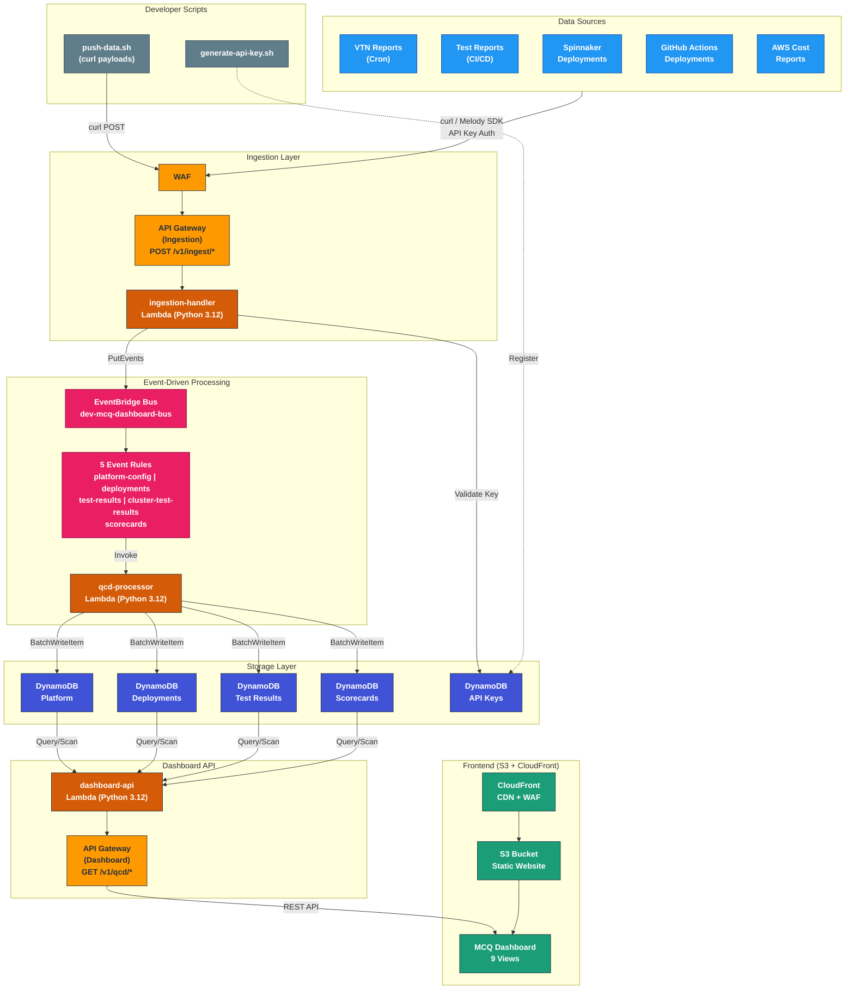

# MCQ Dashboard — Architecture

## System Architecture

## Key Design Decisions

| Aspect | Choice | Rationale |
|--------|--------|-----------|
| Compute | AWS Lambda | Zero servers, pay-per-invocation, auto-scaling |
| Storage | DynamoDB (on-demand) | Sub-ms reads, schemaless JSON, zero admin |
| Event routing | EventBridge | Decoupled, rule-based routing, extensible |
| Frontend hosting | S3 + CloudFront | Global CDN, zero-origin servers |
| Security | WAF + API Key auth | Rate limiting, IP filtering, key validation |
| IaC | Terraform + Terragrunt | Modular, DRY, multi-env ready |

## Data Flow Summary

1. **Ingest** — Data sources POST JSON to `/v1/ingest/{type}` with API key
2. **Validate** — `ingestion-handler` checks the API key against DynamoDB
3. **Route** — Valid events are published to EventBridge with a detail-type
4. **Process** — `qcd-processor` receives matched events and writes to DynamoDB
5. **Serve** — `dashboard-api` reads from DynamoDB and returns JSON via REST
6. **Display** — SPA frontend fetches from the Dashboard API and renders views
